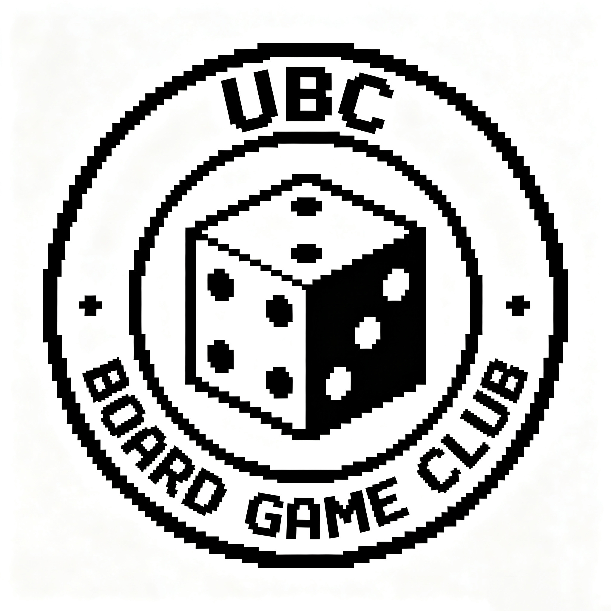

Hi, I'm Jerry Jin! I grew up in Shanghai and have lived in Vancouver since Grade 10. After completing my Bachelor of Science in Mathematics at UBC, I joined the Master of Data Science program to learn how to apply mathematical ideas to real-world problems.

On this website, I share projects and reflections from my time in MDS. Visit my [blog](blog.qmd) to see what I'm working on, or read [more about me](about.qmd).

{width=250px}
